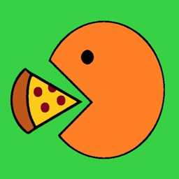

# Despertarse
To eat  

## Conjugación
### Presente
| singular             | plural                      |
|----------------------|-----------------------------|
| yo como              | nosotros comemos            |
| tú comes             | vosotros coméis             |
| él, ella, usted come | ellos, ellas, ustedes comen |
| vos te comés         |                             |

### Ejemplo
Osvaldo y Pedro me deben mucho dinero.