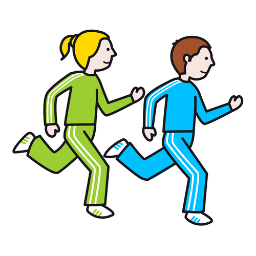

# Despertarse

To run  

## Conjugación

### Presente

| singular              | plural                       |
|-----------------------|------------------------------|
| yo corro              | nosotros corremos            |
| tú corres             | vosotros corréis             |
| él, ella, usted corre | ellos, ellas, ustedes corren |
| vos te corrés         |                              |

### Ejemplo

Osvaldo y Pedro me deben mucho dinero.