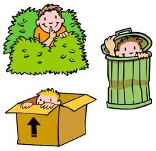

# Esconder

To hide  

## Conjugación

### Presente

| singular                | plural                         |
|-------------------------|--------------------------------|
| yo escondo              | nosotros escondemos            |
| tú escondes             | vosotros escondéis             |
| él, ella, usted esconde | ellos, ellas, ustedes esconden |
| vos te escondés         |                                |

### Ejemplo

Tengo un hacha y sé dónde esconder un cadáver.  
Solo significa que tienes menos que esconder.